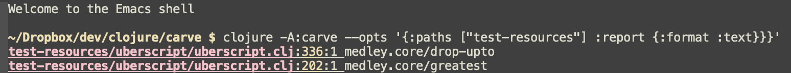

# Carve

[](https://circleci.com/gh/borkdude/carve/tree/master)
[](https://codecov.io/gh/borkdude/carve)

Carve out the essentials of your Clojure app.

## Rationale

Carve will search through your code for unused vars and will remove them.

## Status

Experimental. Use with caution! Breaking changes may happen. Feedback and bugfix PRs welcome.

## Installation

Add to your `deps.edn` under the `:aliases` key:

``` clojure
:carve {:extra-deps {borkdude/carve {:git/url "https://github.com/borkdude/carve"
                                     :sha "4b5010a09e030dbd998faff718d12400748ab3b9"}}
        :main-opts ["-m" "carve.main"]}
```

or use any later SHA.

## How does it work?

Carve invokes [clj-kondo](https://github.com/borkdude/clj-kondo) and uses the [analysis](https://github.com/borkdude/clj-kondo/tree/master/analysis) information to check which vars are unused. To remove the relevant bits of code it uses [rewrite-cljc](https://github.com/lread/rewrite-cljc-playground).

## Usage

The usage for a typical Clojure app looks like:

```
clojure -A:carve --opts '{:paths ["src" "test"]}'
```

Currently `carve` only has one command line option, `--opts`, which
expects an EDN map of the following options of which only `:paths` is required:

- `:paths`: a list of paths to analyze. Can be a mix of individual files and directories.
- `:ignore-vars`: a list of vars to ignore. Useful for when the analyzer has it wrong or you just want to keep the var for whatever reason.
- `:api-namespaces`: a list of namespaces of which only unused private vars will
  be reported.
- `:carve-ignore-file`: a file where ignored vars can be stored, `.carve_ignore`
  by default.
- `:interactive?`: ask what to do with an unused var: remove from the file, add
  to `.carve_ignore` or continue. Set to `true` by default.
- `:out-dir`: instead of writing back to the original file, write to this dir.
- `:dry-run?`: just print the unused var expression.
- `:aggressive?`: runs multiple times until no unused vars are left. Defaults to `false`.
- `:report`: when truthy, prints unused vars to stdout. Implies `:dry-run?
  true`. The output format may be set using `:report {:format ...}` where format
  can be `:edn` or `:text`. The text output can be interpreted by editors like
  Emacs. This option can be combined with `:aggressive?`.

``` shell
$ clojure -A:carve --opts '{:paths ["test-resources"] :dry-run? true}'
Carving test-resources/app.clj

Found unused var:
(defn unused-function [])

...

Carving test-resources/api.clj

Found unused var:
(defn- private-lib-function [])

...
```

``` shell
$ clojure -A:carve --opts '{:paths ["test-resources"]}'
Carving test-resources/app.clj

Found unused var:
(defn unused-function [])

Type Y to remove or i to add app/unused-function to .carve_ignore
n
Found unused var:
(defn another-unused-function [])

Type Y to remove or i to add app/another-unused-function to .carve_ignore
i
...

$ cat .carve_ignore
app/another-unused-function
```

Keep in mind that if you ran `carve` with `'{:paths ["src" "test"]}'`, there might still be potentially lots of unused code, which wasn't detected simply because there are tests for it.

So after a first cycle of carving you might want to do another run with simply `{:paths ["src"]}`, which will help deleting the rest of the unused code.
*Just beware that this will break all the tests using the code you just deleted, and you'll have to fix/delete them manually.**

### CI integration

A good use case for Carve is the CI integration, to ensure that noone can introduce dead code into a codebase.
This example shows how to add this step into CircleCI, but any other CI configuration will be similar.

First add this configuration into a `.circleci/deps.edn` file:

```clojure
{:aliases
 {:carve {:extra-deps {borkdude/carve {:git/url "https://github.com/borkdude/carve"
                                       :sha "$LATEST_CARVE_SHA"}}
          :main-opts ["-m" "carve.main"]}}}
```

Then configure your build step like this:

```yaml
find_dead_code:
  working_directory: ~/$your-project
  docker:
    - image: circleci/clojure:openjdk-11-tools-deps

  steps:
    - checkout
    - run: mkdir -p ~/.clojure && cp .circleci/deps.edn ~/.clojure/deps.edn
    - run: clojure -Acarve --opts '{:paths ["src" "test"] :report {:format :text}}'
```

If the `report` step finds any dead code it exits with status code `1`, thus failing the build step.

### Emacs

In Emacs you might want to invoke carve using the `:report` option in `eshell`. When you enable `compilation-minor-mode` the links become clickable.



## License

Copyright © 2019 Michiel Borkent

Distributed under the EPL License. See LICENSE.
